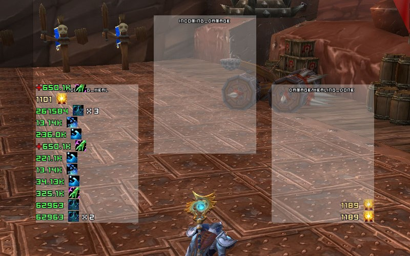

# xCT

 A modified verison of xCT to suit my personal preferences and works with [oUF_Lua](https://github.com/PedroZC90/oUF_Lua).

 xCT is a minimal combat text addon for [World of Warcraft](https://worldofwarcraft.com/en-us/).

<figure>
	<figcaption>Example: xCT ScreenShot</figcaption>
	
</figure>

## Features:

 - It handles aoe spam, merging the total damage and displaying the total damage/heal and the number of times it happened [total (xN)]. (config spell table *AOE_SPAM*)

 - It hides/filters specific healing spells, help to prevent healing spam from passive healing, etc. (config spell table *HEAL_FILTER*).

 - It handles just incoming/outgoing damage and healing.

	1. incoming damage.
	2. incoming healing only (self heal included).
	3. outgoing damage/healing (damage and healing done).

 - New frame can be added through the table *Frames* at **config.lua** (see example at file).

 **obs.:**
 ```
 1. Just Priest, Monk, Druid and Shaman classes spells have been configured.
 2. I use incoming damage disable, so remember to enable it at config.lua.
```
## Info:

 **Author:** Affli @ RU-Howling Fjord

## License:

 Please see [LICENSE](https://github.com/PedroZC90/xCT/blob/master/LICENSE) file.